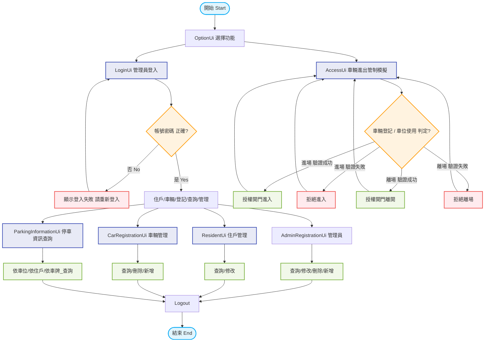

# 🚗 e社區-車牌辨識進出管制與住戶資訊一體化

## 專案介紹

Car4Web為一套使用 Java 開發的社區停車管理系統，採用 MVC 分層架構與 DAO Pattern，並以 MySQL 作為資料庫。

系統提供管理員維護社區住戶、車輛、停車位及車輛進出資料，讓社區停車資訊能集中管理與快速查詢。

---

# 系統特色

* Java Swing 圖形化介面
* MVC 分層架構
* DAO Pattern
* JDBC 資料存取
* MySQL 資料庫
* Maven 專案管理
* Eclipse + WindowBuilder 開發

---

# 開發環境

| 項目         | 版本            |
| ---------- | ------------- |
| Java       | JDK 21        |
| IDE        | Eclipse       |
| GUI        | Web |
| Build Tool | Maven         |
| Database   | MySQL 8.0     |

---

# 系統架構

```text

UI (Web)
    │
    ▼
Controller
    │
    ▼
Service
    │
    ▼
DAO
    │
    ▼
Model


```

---

# 專案目錄

```text
Car4Web
├── src/main/java
│      ├── config
│      ├── controller
│      ├── service
│      ├── dao
│      ├── model
│      ├── util
│      ├── view
├── pom.xml
└── README.md
```

---

# 功能介紹

## 系統登入

* 主功能選單
* 社區車輛進出車牌識別 
* 社區管理員登入
* 

## 管理員管理

* 管理員資料維護
* 管理員資料查詢

## 住戶管理

* 查詢住戶資料
* 更新住戶資料

## 車輛管理

* 車輛登記
* 車輛資料維護
* 車牌查詢

## 車輛進出管理

* 車輛進出管控
* 車輛進出紀錄
* 進出資訊查詢

## 停車資訊查詢

* 停車位資訊查詢
* 車牌資訊查詢
* 住戶與停車位對應查詢

---

# 資料庫

* 使用 MySQL 資料庫 。
* 資料庫關聯圖 (ER Diagram)

       [admin_registration] (管理員註冊)
      ┌─────────────────────────────┐
      │ PK │ id                     │
      │    │ account, password, name│
      │    │ phone, date, class1    │
      └─────────────────────────────┘

       [resident] (社區住戶)
      ┌─────────────────────────────┐
      │ PK │ resident_id            │───────────────┐
      │    │ address_simple         │               │
      │    │ address_complete       │               │
      │    │ parking_space_owner    │               │
      │    │ parking_space_user     │               │
      └─────────────────────────────┘               │ (resident_id) 住戶ID
                                                    │ 1 對 N
                                                    │ 
       [car_registration] (車輛登記)                 │
      ┌─────────────────────────────┐               │
      │ FK │ resident_id            │◄──────────────┘
      │    │ address_simple         │
      │    │ car_serial_number      │                
      │ PK │ license_plate_number   │───────────────┐
      │    │ occupied_available     │               │
      │    │ car_user,car_user_phone│               │
      └─────────────────────────────┘               │ 
                                                    │ (license_plate_number) 車牌號碼
       [access_logs] (進出紀錄)                      │ 1 對 N
      ┌─────────────────────────────┐               │
      │    │ date                   │               │
      │ FK │ license_plate_number   │◄──────────────┘
      │    │ car_user,car_user_phone│
      │    │ entry_exit             │
      │    │ reason, alert          │
      └─────────────────────────────┘


---

# 執行方式

1. 匯入 Maven Project。
2. 設定 JDK 11。
3. 建立 MySQL 資料庫並匯入 SQL。
4. 修改資料庫連線設定。
5. 執行登入畫面作為系統入口。

---

# 使用的應用技術

* 前端 Java Script / 車牌辨識 / Azure API
* 後端 Java JAX-RS + JDBC
* session
* Token
* MySQL
* Maven
* MVC Pattern
* DAO Pattern
* SSH

---

# 專案特色

* 採用分層式架構設計，方便維護與擴充。
* 使用MVC DAO pattern 將資料庫操作與java寫法將程式商業化。
* 提供圖形化操作介面，提升使用便利性。
* 透過 MySQL 儲存住戶、車輛及停車相關資料。

---


# 操作流程圖




# 操作方式
## 車輛進出管控模擬:
* 左邊輸入車號後按確認模擬車輛進入,管制內容 (1)已登入的車輛 及(2)車輛未進停車場才會開門放行, 如果車輛已進停車場將管制進入. 
* 右邊輸入車號後按確認模擬車輛外出,管制內容 (1)已登入的車輛即可開門放行
* 每住戶可登記兩台車輛, 若其中一台車輛已進入停車場, 另一台車輛將管制開門進入, 直到車子離開停車場.
* 未登記車輛禁止進出.
  <br><br>
  

## 住戶資料查詢及更新 
* 依下拉式選單查詢住戶資料
* 先查詢住戶資料後,提供更新按鈕更新住戶資料
* 住戶車輛及停車位狀態查詢
* 提供刪除及新增按鈕,進行刪除或新增住戶的車輛登記
  <br><br>
  

## 批量查詢
* 選擇批量查詢進入下列選項:
* 車輛進出記錄查詢(依據日期及車號)
* 社區停車位使用狀態批量查詢
* 已登記車輛批量查詢
* 住戶資料批量查詢
  <br><br>
  


* 一般管理員帳戶 查詢/新增/刪除/修改
* 需使用超級管理員(admin)權限才能查詢/新增/刪除/修改
  <br><br>
  
