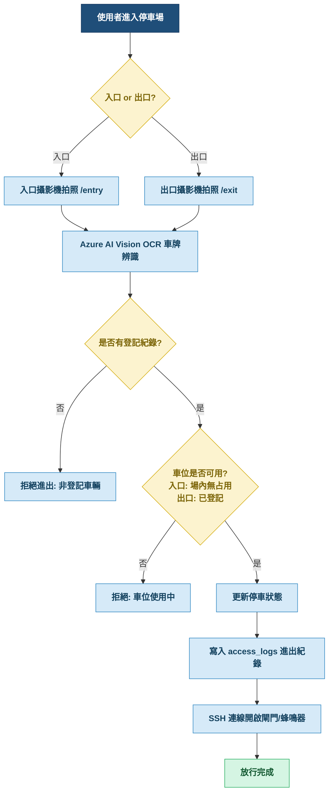
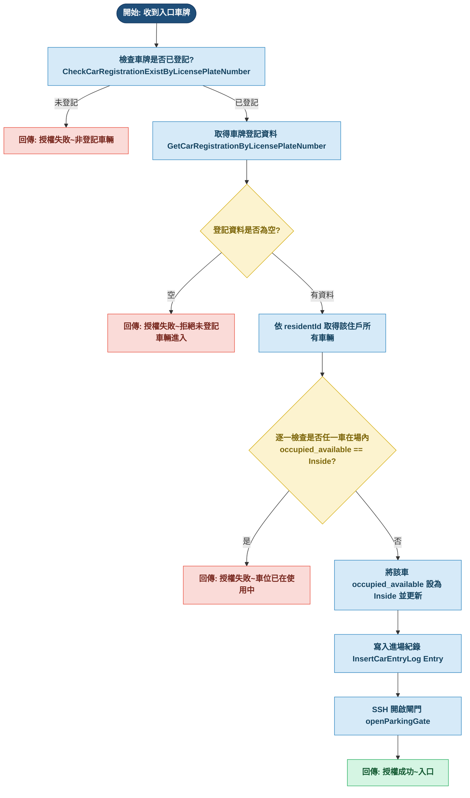
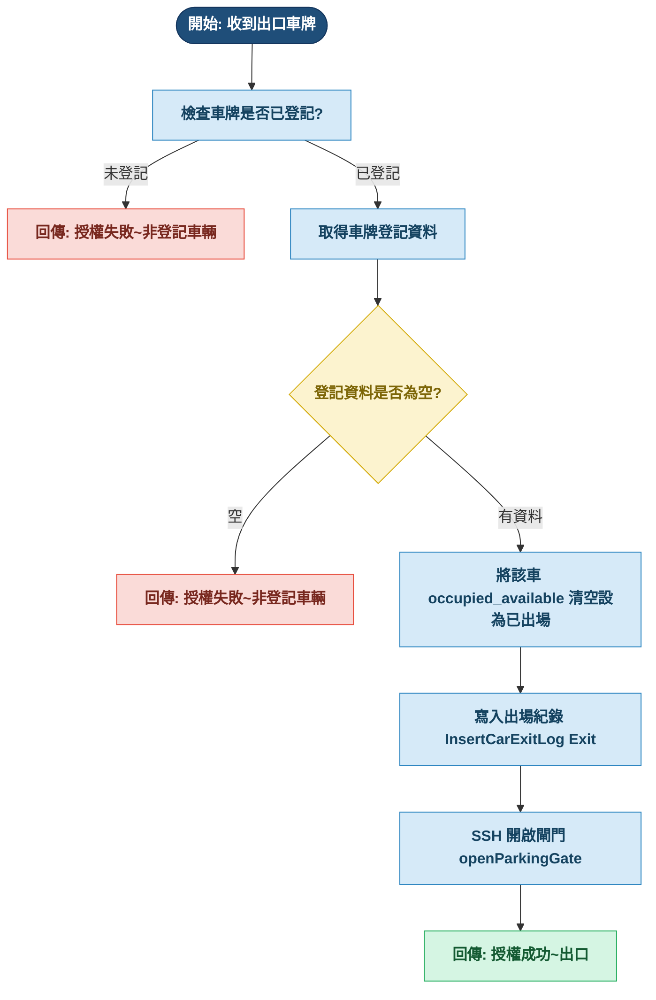
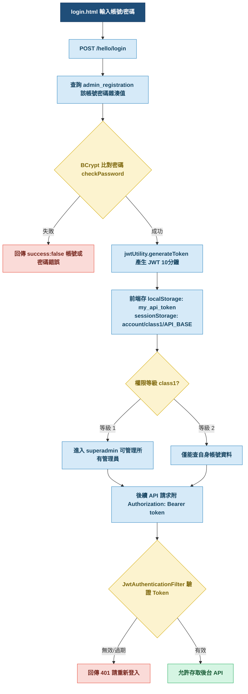
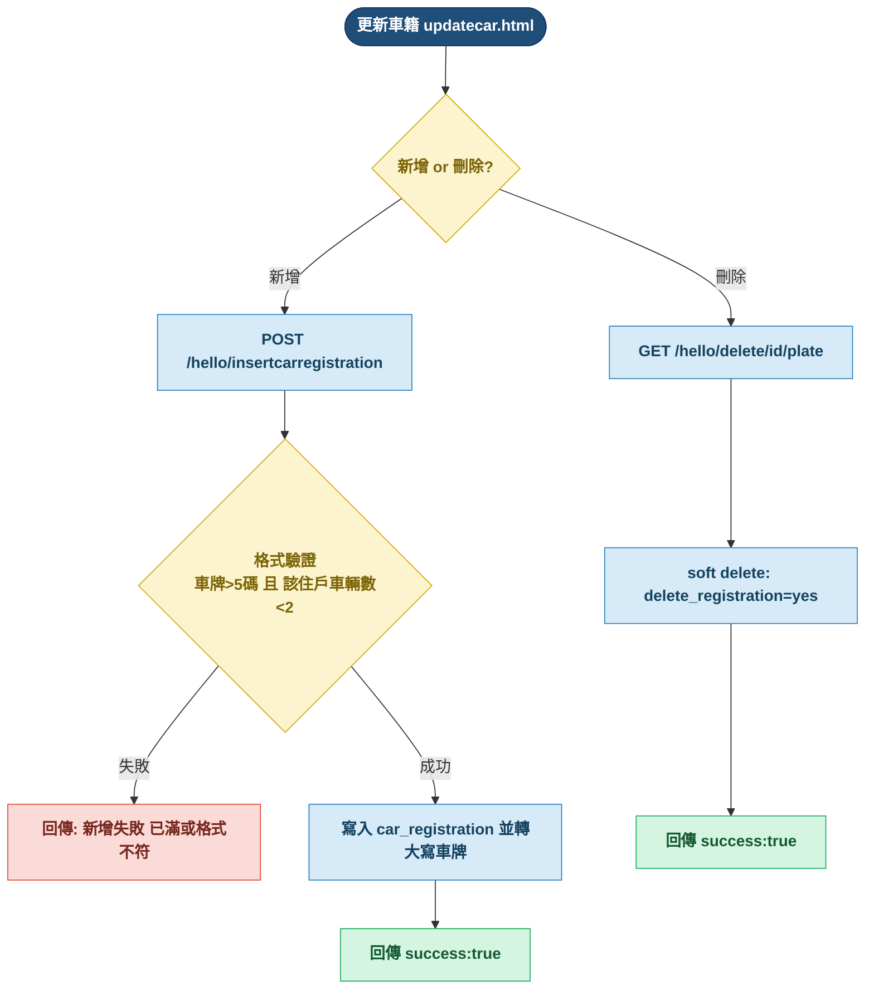

<div style="text-align: center; width: 100%;"><span style="color:#1F4E79;font-size:3em;font-weight:bold;">e居家</span></div>

<div style="text-align: center; width: 100%;"><span style="color:#1F4E79;font-size:2em;font-weight:bold;">社區停車場智慧進出管理系統設計報告</span></div>

|          |                                                                               |
| -------- | ----------------------------------------------------------------------------- |
| 專案路徑 | `\\192.168.137.142\Qsync\ocp20260902`                                         |
| 專案名稱 | ParkingWeb（社區停車場進出管理系統）                                          |
| 報告日期 | 2026-09-02                                                                    |
| 系統定位 | 社區（住宅大樓）停車場之進出授權、車牌辨識、停車管理與後台管理的 Web 應用系統 |

---

## 目錄

1. [專案概述](#1-專案概述)
2. [需求分析](#2-需求分析-requirements)
3. [規格說明](#3-規格說明-specifications)
4. [流程圖](#4-流程圖-flowcharts)
5. [安全機制](#5-安全機制)
6. [結語](#6-結語)

---

## <span style="color:#1F4E79;">▍</span> 1. 專案概述

本系統是一套以 **車牌辨識 (License Plate Recognition, LPR)** 為核心的社區停車場管理系統，提供：

1. **車牌自動辨識與進出授權**：於入口/出口設置攝影機拍照，透過 **Azure AI Vision (OCR)** 雲端辨識車牌，比對車籍登記資料後決定是否開啟閘門。
2. **硬體閘門控制**：授權成功後，透過 **SSH (JSch)** 連線至閘門控制器主機（`192.168.137.142`），遠端呼叫 `CallBeepX` 程式執行 `CallBeep.java` 開啟閘門/蜂鳴器。
3. **住戶與車籍資料管理**：管理人員可查詢住戶、維護車位所有人/使用人、登記車輛（每戶最多 2 台）。
4. **後台會員權限管理**：超級管理員可管理一般管理員帳號（新增/修改/刪除/查詢），並以 JWT Token 做身分驗證與權限控管。
5. **進出紀錄查詢**：可依日期區間與車牌查詢車輛進出歷史紀錄。

---

## <span style="color:#1F4E79;">▍</span> 2. 需求分析 (Requirements)

### 2.1 使用者角色

<table style="width:100%;border-collapse:collapse;font-size:15px;">
  <thead>
    <tr style="background:#1F4E79;color:#FFFFFF;text-align:left;">
      <th style="padding:8px 12px;border:1px solid #AED1EE;">角色</th>
      <th style="padding:8px 12px;border:1px solid #AED1EE;">權限等級 (class1)</th>
      <th style="padding:8px 12px;border:1px solid #AED1EE;">主要功能</th>
    </tr>
  </thead>
  <tbody>
    <tr style="background:#F7FAFD;">
      <td style="padding:7px 12px;border:1px solid #AED1EE;"><b>超級管理員 (Super Admin)</b></td>
      <td style="padding:7px 12px;border:1px solid #AED1EE;text-align:center;color:#1F4E79;font-weight:bold;">1</td>
      <td style="padding:7px 12px;border:1px solid #AED1EE;">管理所有管理員帳號、查看所有管理員資料、完整停車管理與住戶/車籍維護</td>
    </tr>
    <tr style="background:#F7FAFD;">
      <td style="padding:7px 12px;border:1px solid #AED1EE;"><b>一般管理員 (Manager)</b></td>
      <td style="padding:7px 12px;border:1px solid #AED1EE;text-align:center;color:#1F4E79;font-weight:bold;">2</td>
      <td style="padding:7px 12px;border:1px solid #AED1EE;">停車管理、住戶查詢與維護、車籍登記、進出紀錄查詢（僅能查詢自身帳號資料）</td>
    </tr>
    <tr style="background:#F7FAFD;">
      <td style="padding:7px 12px;border:1px solid #AED1EE;"><b>車輛使用者（住戶）</b></td>
      <td style="padding:7px 12px;border:1px solid #AED1EE;text-align:center;color:#7F8C8D;">—</td>
      <td style="padding:7px 12px;border:1px solid #AED1EE;">透過車牌辨識自動進出停車場，無需登入操作</td>
    </tr>
  </tbody>
</table>


### 2.2 功能需求

#### 2.2.1 入口授權流程（Entry）

- 上傳入口攝影機照片。
- 呼叫 Azure OCR 辨識車牌。
- 檢查車牌是否為「已登記」車輛。
- 檢查該住戶之車位是否「尚未占用」（任一已登記車在場內 → 禁入）。
- 條件全部通過 → 更新停車狀態為「場內 (Inside)」、寫入進出紀錄、開啟閘門。
- 任一條件未通過 → 拒絕進入並回傳失敗原因。

#### 2.2.2 出口授權流程（Exit）

- 上傳出口照片 → Azure 辨識車牌。
- 檢查是否為已登記車輛。
- 通過 → 更新停車狀態為「已出場」、寫入進出紀錄、開啟閘門。
- 未登記 → 拒絕出場。

#### 2.2.3 後台管理功能

- **登入**：帳號 + 密碼（BCrypt 加密驗證），成功後發放 JWT Token（10 分鐘有效）。
- **會員（管理員）管理**（`superadmin.html`）：新增、修改、刪除、查詢管理員帳號。
  - 等級 1 可查詢/管理所有管理員；
  - 等級 2 僅能查詢/修改自身帳號。
- **住戶管理**（`manager1.html`）：依「車牌／門牌／車位／住戶ID」查詢住戶。
- **住戶資料維護**（`update.html`）：修改車位所有人/使用人及其電話。
- **車籍維護**（`updatecar.html`）：新增（每戶上限 2 台）、刪除（軟刪除）車輛登記。
- **進出紀錄查詢**：依日期區間 + 車牌查詢。

### 2.3 非功能需求

- 車牌格式須符合台灣車牌規則（英數組合，中間含「`-`」）。
- 車牌資料一律「轉大寫」儲存與比對。
- 所有管理後台 API 需附帶 JWT Token 進行身分驗證（除外白名單）。
- 敏感資料（Azure 金鑰、SSH 帳密、Token 密鑰）以 `.env` 檔案存放並 AES 加解密。

---

## <span style="color:#1F4E79;">▍</span> 3. 規格說明 (Specifications)

### 3.1 技術架構

```
┌─────────────────────────────────────────────────────┐
│  前端 (Web)  HTML / CSS / JavaScript / fetch(API)    │
└───────────────┬─────────────────────────────────────┘
                │ HTTP/JSON (+JWT Bearer Token)
┌───────────────▼────────────────────────────────────┐
│  後端  Java 21 + Jakarta EE 10 + Jersey (JAX-RS)    │
│  Web 應用 (WAR) 部署於 Tomcat 10.1                   │
└───────┬─────────────────────────────┬──────────────┘
        │ JDBC (mysql-connector-j)    │ JSch (SSH)
┌───────▼─────────┐          ┌────────▼──────────────┐
│  MySQL 資料庫    │          │ 閘門控制器主機          │
│  database: gjun │          │ 192.168.137.142       │
└─────────────────┘          │ 執行 CallBeepX→hal_app │
                             └───────────────────────┘
```

### 3.2 開發環境與相依套件

<table style="width:100%;border-collapse:collapse;font-size:15px;">
  <thead>
    <tr style="background:#1F4E79;color:#FFFFFF;text-align:left;">
      <th style="padding:8px 12px;border:1px solid #AED1EE;width:25%;">項目</th>
      <th style="padding:8px 12px;border:1px solid #AED1EE;">規格</th>
    </tr>
  </thead>
  <tbody>
    <tr style="background:#F7FAFD;"><td style="padding:7px 12px;border:1px solid #AED1EE;"><b>Java</b></td><td style="padding:7px 12px;border:1px solid #AED1EE;">21（<code>maven.compiler.source/target = 21</code>）</td></tr>
    <tr style="background:#F7FAFD;"><td style="padding:7px 12px;border:1px solid #AED1EE;"><b>應用伺服器</b></td><td style="padding:7px 12px;border:1px solid #AED1EE;">Apache Tomcat 10.1（HTTP Port 8080）</td></tr>
    <tr style="background:#F7FAFD;"><td style="padding:7px 12px;border:1px solid #AED1EE;"><b>前端</b></td><td style="padding:7px 12px;border:1px solid #AED1EE;">HTML5 + JavaScript (vanilla) + fetch + localStorage/sessionStorage</td></tr>
    <tr style="background:#F7FAFD;"><td style="padding:7px 12px;border:1px solid #AED1EE;"><b>後端</b></td><td style="padding:7px 12px;border:1px solid #AED1EE;">Jakarta EE 10、JAX-RS 3.1 + Jersey 3.1.6</td></tr>
    <tr style="background:#F7FAFD;"><td style="padding:7px 12px;border:1px solid #AED1EE;"><b>資料庫</b></td><td style="padding:7px 12px;border:1px solid #AED1EE;">MySQL（<code>com.mysql:mysql-connector-j:8.4.0</code>），資料庫名稱 <code>gjun</code></td></tr>
    <tr style="background:#F7FAFD;"><td style="padding:7px 12px;border:1px solid #AED1EE;"><b>車牌辨識</b></td><td style="padding:7px 12px;border:1px solid #AED1EE;">Azure AI Vision ImageAnalysis SDK <code>1.0.0</code>（OCR / READ）</td></tr>
    <tr style="background:#F7FAFD;"><td style="padding:7px 12px;border:1px solid #AED1EE;"><b>閘門控制</b></td><td style="padding:7px 12px;border:1px solid #AED1EE;">JSch <code>0.1.55</code>（SSH 遠端執行）</td></tr>
    <tr style="background:#F7FAFD;"><td style="padding:7px 12px;border:1px solid #AED1EE;"><b>認證</b></td><td style="padding:7px 12px;border:1px solid #AED1EE;">JJWT <code>0.12.6</code>（JWT 產生/驗證）</td></tr>
    <tr style="background:#F7FAFD;"><td style="padding:7px 12px;border:1px solid #AED1EE;"><b>密碼加密</b></td><td style="padding:7px 12px;border:1px solid #AED1EE;">jBCrypt <code>0.4</code>（BCrypt hash）</td></tr>
    <tr style="background:#F7FAFD;"><td style="padding:7px 12px;border:1px solid #AED1EE;"><b>敏感資料</b></td><td style="padding:7px 12px;border:1px solid #AED1EE;">dotenv-java <code>3.0.0</code> + AES（<code>EncryptionUtil</code>）</td></tr>
    
  </tbody>
</table>

### 3.3 應用程式基礎結構

- REST API 根路徑：`@ApplicationPath("/api")`（`config/MyAppConfig.java`）
- 主要 Controller：`controller/hello.java`（`/api/hello/...`）、`EntryPhoto`（`/api/entry`）、`ExitPhoto`（`/api/exit`）
- 分層架構：**前端Web → 後端Controller → Service → DAO → JDBC → MySQL**
- 認證過濾器：`util/JwtAuthenticationFilter.java`（`@Provider`）

### 3.4 資料庫規格（MySQL, database: `gjun`）

<table style="width:100%;border-collapse:collapse;font-size:14px;">
  <thead>
    <tr style="background:#1F4E79;color:#FFFFFF;text-align:left;">
      <th style="padding:8px 12px;border:1px solid #AED1EE;width:20%;">資料表</th>
      <th style="padding:8px 12px;border:1px solid #AED1EE;width:15%;">用途</th>
      <th style="padding:8px 12px;border:1px solid #AED1EE;">主要欄位</th>
    </tr>
  </thead>
  <tbody>
    <tr style="background:#F7FAFD;"><td style="padding:7px 12px;border:1px solid #AED1EE;"><code style="color:#1F4E79;font-weight:bold;">resident</code></td><td style="padding:7px 12px;border:1px solid #AED1EE;">住戶資料</td><td style="padding:7px 12px;border:1px solid #AED1EE;"><code>resident_id</code>(PK)、<code>address_simple</code>、<code>address_complete</code>、<code>parking_space_owner</code>、<code>parking_space_owner_phone</code>、<code>parking_space_user</code>、<code>parking_space_user_phone</code>、<code>parking_space_number</code>、<code>parking_space_floor</code>、<code>create_date</code>、<code>update_date</code></td></tr>
    <tr style="background:#F7FAFD;"><td style="padding:7px 12px;border:1px solid #AED1EE;"><code style="color:#1F4E79;font-weight:bold;">car_registration</code></td><td style="padding:7px 12px;border:1px solid #AED1EE;">車籍登記</td><td style="padding:7px 12px;border:1px solid #AED1EE;"><code>resident_id</code>、<code>address_simple</code>、<code>car_serial_number</code>、<code>license_plate_number</code>、<code>occupied_available</code>(Inside=場內)、<code>car_user</code>、<code>car_user_phone</code>、<code>car_registration_date</code>、<code>delete_registration</code>(yes=軟刪除)</td></tr>
    <tr style="background:#F7FAFD;"><td style="padding:7px 12px;border:1px solid #AED1EE;"><code style="color:#1F4E79;font-weight:bold;">admin_registration</code></td><td style="padding:7px 12px;border:1px solid #AED1EE;">管理員帳號</td><td style="padding:7px 12px;border:1px solid #AED1EE;"><code>id</code>、<code>account</code>、<code>password</code>(BCrypt)、<code>name</code>、<code>phone</code>、<code>date</code>、<code>class1</code>(1=超管, 2=一般)</td></tr>
    <tr style="background:#F7FAFD;"><td style="padding:7px 12px;border:1px solid #AED1EE;"><code style="color:#1F4E79;font-weight:bold;">access_logs</code></td><td style="padding:7px 12px;border:1px solid #AED1EE;">進出紀錄</td><td style="padding:7px 12px;border:1px solid #AED1EE;"><code>id</code>、<code>date</code>、<code>license_plate_number</code>、<code>car_user</code>、<code>car_user_phone</code>、<code>entry_exit</code>(Entry/Exit)、<code>reason</code>、<code>alert</code></td></tr>
    <tr style="background:#F7FAFD;"><td style="padding:7px 12px;border:1px solid #AED1EE;">檢視表 (view)</td><td style="padding:7px 12px;border:1px solid #AED1EE;">彙總查詢</td><td style="padding:7px 12px;border:1px solid #AED1EE;"><code>vo_resident_parking</code>（住戶+車籍+車位彙總）、<code>vo_license_plate_number_list</code></td></tr>
  </tbody>
</table>


### 3.5 主要 API 規格

<table style="width:100%;border-collapse:collapse;font-size:14px;">
  <thead>
    <tr style="background:#1F4E79;color:#FFFFFF;text-align:left;">
      <th style="padding:8px 12px;border:1px solid #AED1EE;width:12%;">Method</th>
      <th style="padding:8px 12px;border:1px solid #AED1EE;width:40%;">路徑（相對於 <code>/api</code>）</th>
      <th style="padding:8px 12px;border:1px solid #AED1EE;">功能</th>
      <th style="padding:8px 12px;border:1px solid #AED1EE;width:10%;">需 JWT</th>
    </tr>
  </thead>
  <tbody>
    <tr style="background:#F7FAFD;"><td style="padding:6px 12px;border:1px solid #AED1EE;text-align:center;color:#21618C;font-weight:bold;">GET</td><td style="padding:6px 12px;border:1px solid #AED1EE;"><code>/hello</code></td><td style="padding:6px 12px;border:1px solid #AED1EE;">API測試 (Hello World)</td><td style="padding:6px 12px;border:1px solid #AED1EE;text-align:center;color:#B03A2E;">—</td></tr>
    <tr style="background:#F7FAFD;"><td style="padding:6px 12px;border:1px solid #AED1EE;text-align:center;color:#1E8449;font-weight:bold;">POST</td><td style="padding:6px 12px;border:1px solid #AED1EE;"><code>/hello/login</code></td><td style="padding:6px 12px;border:1px solid #AED1EE;">登入，回傳 JWT</td><td style="padding:6px 12px;border:1px solid #AED1EE;text-align:center;color:#B9770E;">否（白名單）</td></tr>
    <tr style="background:#F7FAFD;"><td style="padding:6px 12px;border:1px solid #AED1EE;text-align:center;color:#1E8449;font-weight:bold;">POST</td><td style="padding:6px 12px;border:1px solid #AED1EE;"><code>/hello/getallmanager</code></td><td style="padding:6px 12px;border:1px solid #AED1EE;">超級管理員（等級1）</td><td style="padding:6px 12px;border:1px solid #AED1EE;text-align:center;color:#1E8449;">是</td></tr>
    <tr style="background:#F7FAFD;"><td style="padding:6px 12px;border:1px solid #AED1EE;text-align:center;color:#1E8449;font-weight:bold;">POST</td><td style="padding:6px 12px;border:1px solid #AED1EE;"><code>/hello/getmanager</code></td><td style="padding:6px 12px;border:1px solid #AED1EE;">一般管理員（等級2）</td><td style="padding:6px 12px;border:1px solid #AED1EE;text-align:center;color:#1E8449;">是</td></tr>
    <tr style="background:#F7FAFD;"><td style="padding:6px 12px;border:1px solid #AED1EE;text-align:center;color:#B03A2E;font-weight:bold;">POST/PUT<br>DELETE</td><td style="padding:6px 12px;border:1px solid #AED1EE;"><code>/hello/admcrud[/{id}]</code></td><td style="padding:6px 12px;border:1px solid #AED1EE;">新增/修改/刪除管理員</td><td style="padding:6px 12px;border:1px solid #AED1EE;text-align:center;color:#1E8449;">是</td></tr>
    <tr style="background:#F7FAFD;"><td style="padding:6px 12px;border:1px solid #AED1EE;text-align:center;color:#21618C;font-weight:bold;">GET</td><td style="padding:6px 12px;border:1px solid #AED1EE;"><code>/hello/getallresident</code></td><td style="padding:6px 12px;border:1px solid #AED1EE;">查詢所有住戶</td><td style="padding:6px 12px;border:1px solid #AED1EE;text-align:center;color:#1E8449;">是</td></tr>
    <tr style="background:#F7FAFD;"><td style="padding:6px 12px;border:1px solid #AED1EE;text-align:center;color:#21618C;font-weight:bold;">GET</td><td style="padding:6px 12px;border:1px solid #AED1EE;"><code>/hello/getallresidentbylot</code></td><td style="padding:6px 12px;border:1px solid #AED1EE;">查詢所有住戶（Web用）</td><td style="padding:6px 12px;border:1px solid #AED1EE;text-align:center;color:#1E8449;">是</td></tr>
    <tr style="background:#F7FAFD;"><td style="padding:6px 12px;border:1px solid #AED1EE;text-align:center;color:#21618C;font-weight:bold;">GET</td><td style="padding:6px 12px;border:1px solid #AED1EE;"><code>/hello/getallcarregistration</code></td><td style="padding:6px 12px;border:1px solid #AED1EE;">查詢所有車籍</td><td style="padding:6px 12px;border:1px solid #AED1EE;text-align:center;color:#1E8449;">是</td></tr>
    <tr style="background:#F7FAFD;"><td style="padding:6px 12px;border:1px solid #AED1EE;text-align:center;color:#21618C;font-weight:bold;">GET</td><td style="padding:6px 12px;border:1px solid #AED1EE;"><code>/hello/getallresidentparking</code></td><td style="padding:6px 12px;border:1px solid #AED1EE;">查詢住戶+停車彙總</td><td style="padding:6px 12px;border:1px solid #AED1EE;text-align:center;color:#1E8449;">是</td></tr>
    <tr style="background:#F7FAFD;"><td style="padding:6px 12px;border:1px solid #AED1EE;text-align:center;color:#21618C;font-weight:bold;">GET</td><td style="padding:6px 12px;border:1px solid #AED1EE;"><code>/hello/getEntryExit/{from}/{end}/{plate}</code></td><td style="padding:6px 12px;border:1px solid #AED1EE;">查詢進出紀錄</td><td style="padding:6px 12px;border:1px solid #AED1EE;text-align:center;color:#1E8449;">是</td></tr>
    <tr style="background:#F7FAFD;"><td style="padding:6px 12px;border:1px solid #AED1EE;text-align:center;color:#21618C;font-weight:bold;">GET</td><td style="padding:6px 12px;border:1px solid #AED1EE;"><code>/hello/getresidentbylicenseplatenumber/{no}</code></td><td style="padding:6px 12px;border:1px solid #AED1EE;">車牌查住戶</td><td style="padding:6px 12px;border:1px solid #AED1EE;text-align:center;color:#1E8449;">是</td></tr>
    <tr style="background:#F7FAFD;"><td style="padding:6px 12px;border:1px solid #AED1EE;text-align:center;color:#21618C;font-weight:bold;">GET</td><td style="padding:6px 12px;border:1px solid #AED1EE;"><code>/hello/getresidentbyaddresssimple/{addr}</code></td><td style="padding:6px 12px;border:1px solid #AED1EE;">門牌查住戶</td><td style="padding:6px 12px;border:1px solid #AED1EE;text-align:center;color:#1E8449;">是</td></tr>
    <tr style="background:#F7FAFD;"><td style="padding:6px 12px;border:1px solid #AED1EE;text-align:center;color:#21618C;font-weight:bold;">GET</td><td style="padding:6px 12px;border:1px solid #AED1EE;"><code>/hello/getresidentbyid/{id}</code></td><td style="padding:6px 12px;border:1px solid #AED1EE;">ID查住戶</td><td style="padding:6px 12px;border:1px solid #AED1EE;text-align:center;color:#1E8449;">是</td></tr>
    <tr style="background:#F7FAFD;"><td style="padding:6px 12px;border:1px solid #AED1EE;text-align:center;color:#21618C;font-weight:bold;">GET</td><td style="padding:6px 12px;border:1px solid #AED1EE;"><code>/hello/getresidentbyparkingspacenumber/{no}</code></td><td style="padding:6px 12px;border:1px solid #AED1EE;">車位查住戶</td><td style="padding:6px 12px;border:1px solid #AED1EE;text-align:center;color:#1E8449;">是</td></tr>
    <tr style="background:#F7FAFD;"><td style="padding:6px 12px;border:1px solid #AED1EE;text-align:center;color:#21618C;font-weight:bold;">GET</td><td style="padding:6px 12px;border:1px solid #AED1EE;"><code>/hello/getresidentforcombobox</code></td><td style="padding:6px 12px;border:1px solid #AED1EE;">門牌下拉選單</td><td style="padding:6px 12px;border:1px solid #AED1EE;text-align:center;color:#B9770E;">否（白名單）</td></tr>
    <tr style="background:#F7FAFD;"><td style="padding:6px 12px;border:1px solid #AED1EE;text-align:center;color:#21618C;font-weight:bold;">GET</td><td style="padding:6px 12px;border:1px solid #AED1EE;"><code>/hello/getparkingnumberforcombobox</code></td><td style="padding:6px 12px;border:1px solid #AED1EE;">車位下拉選單</td><td style="padding:6px 12px;border:1px solid #AED1EE;text-align:center;color:#B9770E;">否（白名單）</td></tr>
    <tr style="background:#F7FAFD;"><td style="padding:6px 12px;border:1px solid #AED1EE;text-align:center;color:#1E8449;font-weight:bold;">POST</td><td style="padding:6px 12px;border:1px solid #AED1EE;"><code>/hello/updateresident</code></td><td style="padding:6px 12px;border:1px solid #AED1EE;">更新住戶資料</td><td style="padding:6px 12px;border:1px solid #AED1EE;text-align:center;color:#1E8449;">是</td></tr>
    <tr style="background:#F7FAFD;"><td style="padding:6px 12px;border:1px solid #AED1EE;text-align:center;color:#1E8449;font-weight:bold;">POST</td><td style="padding:6px 12px;border:1px solid #AED1EE;"><code>/hello/insertcarregistration</code></td><td style="padding:6px 12px;border:1px solid #AED1EE;">新增車籍</td><td style="padding:6px 12px;border:1px solid #AED1EE;text-align:center;color:#1E8449;">是</td></tr>
    <tr style="background:#F7FAFD;"><td style="padding:6px 12px;border:1px solid #AED1EE;text-align:center;color:#21618C;font-weight:bold;">GET</td><td style="padding:6px 12px;border:1px solid #AED1EE;"><code>/hello/delete/{id}/{plate}</code></td><td style="padding:6px 12px;border:1px solid #AED1EE;">刪除車籍（軟刪除）</td><td style="padding:6px 12px;border:1px solid #AED1EE;text-align:center;color:#1E8449;">是</td></tr>
    <tr style="background:#F7FAFD;"><td style="padding:6px 12px;border:1px solid #AED1EE;text-align:center;color:#1E8449;font-weight:bold;">POST</td><td style="padding:6px 12px;border:1px solid #AED1EE;"><code>/hello/setsession</code></td><td style="padding:6px 12px;border:1px solid #AED1EE;">寫入 Session 暫存</td><td style="padding:6px 12px;border:1px solid #AED1EE;text-align:center;color:#1E8449;">是</td></tr>
    <tr style="background:#F7FAFD;"><td style="padding:6px 12px;border:1px solid #AED1EE;text-align:center;color:#21618C;font-weight:bold;">GET</td><td style="padding:6px 12px;border:1px solid #AED1EE;"><code>/hello/getsession</code></td><td style="padding:6px 12px;border:1px solid #AED1EE;">讀取 Session 暫存</td><td style="padding:6px 12px;border:1px solid #AED1EE;text-align:center;color:#1E8449;">是</td></tr>
    <tr style="background:#F7FAFD;"><td style="padding:6px 12px;border:1px solid #AED1EE;text-align:center;color:#21618C;font-weight:bold;">GET</td><td style="padding:6px 12px;border:1px solid #AED1EE;"><code>/hello/validation</code></td><td style="padding:6px 12px;border:1px solid #AED1EE;">Token 驗證</td><td style="padding:6px 12px;border:1px solid #AED1EE;text-align:center;color:#1E8449;">是</td></tr>
    <tr style="background:#F7FAFD;"><td style="padding:6px 12px;border:1px solid #AED1EE;text-align:center;color:#1E8449;font-weight:bold;">POST</td><td style="padding:6px 12px;border:1px solid #AED1EE;"><code>/entry</code></td><td style="padding:6px 12px;border:1px solid #AED1EE;">入口拍照+授權</td><td style="padding:6px 12px;border:1px solid #AED1EE;text-align:center;color:#B9770E;">否（白名單）</td></tr>
    <tr style="background:#F7FAFD;"><td style="padding:6px 12px;border:1px solid #AED1EE;text-align:center;color:#1E8449;font-weight:bold;">POST</td><td style="padding:6px 12px;border:1px solid #AED1EE;"><code>/exit</code></td><td style="padding:6px 12px;border:1px solid #AED1EE;">出口拍照+授權</td><td style="padding:6px 12px;border:1px solid #AED1EE;text-align:center;color:#B9770E;">否（白名單）</td></tr>
  </tbody>
</table>


### 3.6 前端畫面（webapp）

<table style="width:100%;border-collapse:collapse;font-size:15px;">
  <thead>
    <tr style="background:#1F4E79;color:#FFFFFF;text-align:left;">
      <th style="padding:8px 12px;border:1px solid #AED1EE;width:30%;">檔案</th>
      <th style="padding:8px 12px;border:1px solid #AED1EE;">功能</th>
    </tr>
  </thead>
  <tbody>
    <tr style="background:#F7FAFD;"><td style="padding:7px 12px;border:1px solid #AED1EE;"><code>index.jsp</code></td><td style="padding:7px 12px;border:1px solid #AED1EE;">首頁，自動轉跳 <code>login.html</code></td></tr>
    <tr style="background:#F7FAFD;"><td style="padding:7px 12px;border:1px solid #AED1EE;"><code style="color:#1F4E79;font-weight:bold;">login.html</code></td><td style="padding:7px 12px;border:1px solid #AED1EE;">登入頁</td></tr>
    <tr style="background:#F7FAFD;"><td style="padding:7px 12px;border:1px solid #AED1EE;"><code>manager1.html</code></td><td style="padding:7px 12px;border:1px solid #AED1EE;">住戶管理主頁（查詢/維護入口）</td></tr>
    <tr style="background:#F7FAFD;"><td style="padding:7px 12px;border:1px solid #AED1EE;"><code style="color:#1F4E79;font-weight:bold;">manager2.html</code></td><td style="padding:7px 12px;border:1px solid #AED1EE;">管理頁（住戶/車輛登記/停車批量查詢）</td></tr>
    <tr style="background:#F7FAFD;"><td style="padding:7px 12px;border:1px solid #AED1EE;"><code>superadmin.html</code></td><td style="padding:7px 12px;border:1px solid #AED1EE;">管理員帳號管理</td></tr>
    <tr style="background:#F7FAFD;"><td style="padding:7px 12px;border:1px solid #AED1EE;"><code style="color:#1F4E79;font-weight:bold;">update.html</code></td><td style="padding:7px 12px;border:1px solid #AED1EE;">住戶資料修改</td></tr>
    <tr style="background:#F7FAFD;"><td style="padding:7px 12px;border:1px solid #AED1EE;"><code>updatecar.html</code></td><td style="padding:7px 12px;border:1px solid #AED1EE;">車籍（車輛）新增/刪除</td></tr>
    <tr style="background:#F7FAFD;"><td style="padding:7px 12px;border:1px solid #AED1EE;"><code style="color:#1F4E79;font-weight:bold;">entry.html</code></td><td style="padding:7px 12px;border:1px solid #AED1EE;">入口拍照上傳</td></tr>
    <tr style="background:#F7FAFD;"><td style="padding:7px 12px;border:1px solid #AED1EE;"><code>exit.html</code></td><td style="padding:7px 12px;border:1px solid #AED1EE;">出口拍照上傳</td></tr>
  </tbody>
</table>

---

## <span style="color:#1F4E79;">▍</span> 4. 流程圖 (Flowcharts)


### 4.1 整體系統流程圖




### 4.2 入口授權詳細流程圖（AuthorizationEntry）



### 4.3 出口授權詳細流程圖（AuthorizationExit）



## 4.4 後台登入與權限流程圖




### 4.5 車輛登記/刪除流程圖



---

## <span style="color:#1F4E79;">▍</span> 5. 安全機制

<table style="width:100%;border-collapse:collapse;font-size:15px;">
  <tbody>
    <tr style="background:#FCF3CF;border:1px solid #F1C40F;">
      <td style="padding:10px 14px;border:1px solid #F1C40F;color:#7D6608;"><b>① 密碼加密</b></td>
      <td style="padding:10px 14px;border:1px solid #F1C40F;">管理員密碼以 <b>BCrypt</b>（加鹽）雜湊儲存，登入時以 <code>checkPassword</code> 驗證；查詢回傳時以 <code>***</code> 遮罩。</td>
    </tr>
    <tr style="background:#D6EAF8;border:1px solid #2E86C1;">
      <td style="padding:10px 14px;border:1px solid #2E86C1;color:#154360;"><b>② JWT 認證</b></td>
      <td style="padding:10px 14px;border:1px solid #2E86C1;">登入後發放 JWT（<code>myTokenSecurtKey</code> 簽章，10 分鐘有效）；<code>JwtAuthenticationFilter</code> 攔截所有後台請求，未帶有效 <code>Bearer Token</code> 回傳 401。</td>
    </tr>
    <tr style="background:#D5F5E3;border:1px solid #27AE60;">
      <td style="padding:10px 14px;border:1px solid #27AE60;color:#145A32;"><b>③ 白名單</b></td>
      <td style="padding:10px 14px;border:1px solid #27AE60;"><code>/hello/login</code>、下拉選單、<code>/entry</code>、<code>/exit</code> 不需 Token（進出授權需允許未登入使用）。</td>
    </tr>
    <tr style="background:#FADBD8;border:1px solid #E74C3C;">
      <td style="padding:10px 14px;border:1px solid #E74C3C;color:#78281F;"><b>④ 敏感資料加密</b></td>
      <td style="padding:10px 14px;border:1px solid #E74C3C;">Azure 金鑰、SSH 帳密、Token 密鑰存放於 <code>.env</code>（<code>F:\Public\TerenceData\security\.env</code>），以 <b>AES</b> 加解密後使用（<code>EncryptionUtil</code>）。</td>
    </tr>
    <tr style="background:#D6EAF8;border:1px solid #2E86C1;">
      <td style="padding:10px 14px;border:1px solid #2E86C1;color:#154360;"><b>⑤ 資料庫連線</b></td>
      <td style="padding:10px 14px;border:1px solid #2E86C1;">使用 <code>PreparedStatement</code> 防範 SQL Injection。</td>
    </tr>
  </tbody>
</table>

---


---

## <span style="color:#1F4E79;">▍</span> 6. 結語

此專案已完整實作「社區停車場車牌辨識智慧進出管理」之核心閉環：

> <span style="color:#1F4E79;font-weight:bold;font-size:16px;">拍照 → Azure OCR 辨識車牌 → 車籍/占用狀態驗證 → 寫入進出紀錄 → SSH 閘門控制</span>

並提供具權限控管（JWT + BCrypt）的後台管理介面，涵蓋住戶、車籍、管理員與進出紀錄之維護與查詢，架構採 `Controller → Service → DAO → JDBC` 分層，易於擴充與維護。

</div>